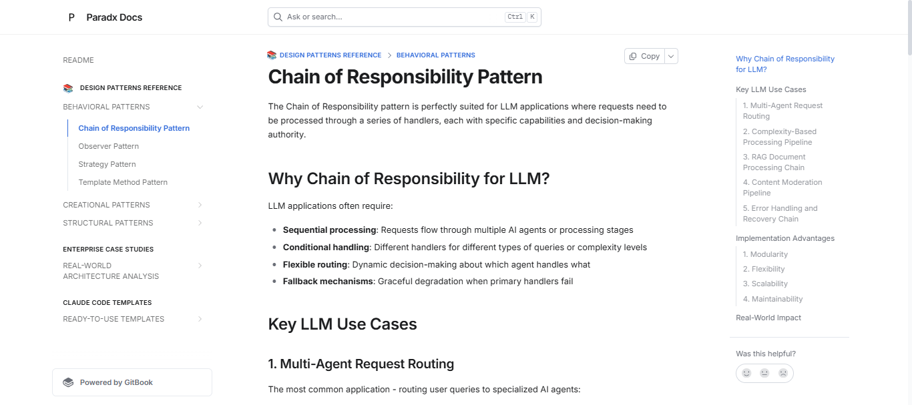

# LLM Python Patterns
Python is an easy-to-use language for hands-on development but may not be as strictly structured as Java or C++ in enforcing coding rules and design patterns.

However, Python has become a powerful partner for LLM development, helping to build modern applications through frameworks such as LangChain, LangGraph, and LangExtract, and playing a significant role in modern application development.

Inspired by the [python-patterns](https://github.com/faif/python-patterns) repo, this project demonstrates how classic design patterns solve real-world challenges in LLM applications. Through hands-on examples, enterprise case studies, and ready-to-use Claude Code templates, we explore practical implementations that enhance system robustness and maintainability.

We also aspire to enable Claude Code to systematically generate high-quality, pattern-based code by providing comprehensive templates and examples that can be intelligently combined for optimal AI system architecture.

## 📚 Documentation

[](https://paradx.gitbook.io/llm-python-patterns/) [](https://github.com/liyedanpdx/llm-python-patterns)

> **📘 Complete Documentation Available**: Visit [GitBook documentation](https://paradx.gitbook.io/llm-python-patterns/) for comprehensive guides, tutorials, and detailed explanations of all design patterns and implementations.



## Design Patterns Overview

| Pattern Category | Pattern Name | Documentation | Project Link | LLM Application Focus |
|------------------|--------------|---------------|--------------|----------------------|
| **Behavioral** | Chain of Responsibility | [chain_of_responsibility_cases.md](./index/behavioral/chain_of_responsibility_cases.md) | - | Agent routing, request processing pipelines, multi-step reasoning workflows |
| | Command | - | - | Tool execution, operation history, undo/redo functionality, agent task encapsulation |
| | Iterator | - | - | Data streaming, batch processing, sequential AI model execution |
| | Mediator | - | - | Multi-agent communication, centralized coordination, system integration |
| | Memento | - | - | Conversation state management, checkpoint/restore, workflow rollback |
| | Observer | [observer_cases.md](./index/behavioral/observer_cases.md) | [observer_pattern.ipynb](./index/behavioral/observer_pattern.ipynb) | Real-time monitoring, cost tracking, performance analytics, system transparency, event-driven coordination, MCP server monitoring |
| | Strategy | [strategy_cases.md](./index/behavioral/strategy_cases.md) | [strategy_pattern.ipynb](./index/behavioral/strategy_pattern.ipynb) | Multi-provider selection, cost optimization, routing algorithms, dynamic model switching, plugin architectures, context management strategies |
| | Template Method | [template_method_cases.md](./index/behavioral/template_method_cases.md) | - | Standardized workflows, document processing pipelines, agent behavior templates, consistent AI processing steps |
| | Visitor | - | - | AST processing, code analysis, hierarchical data traversal |
| **Creational** | Abstract Factory | [abstract_factory_cases.md](./index/creational/abstract_factory_cases.md) | [factory_cases.ipynb](./index/creational/factory_cases.ipynb) | Multi-provider AI families, agent ecosystems, tool families, environment-specific components |
| | Builder | [builder.md](./index/creational/builder.md) | - | Complex prompt construction, configurable pipelines, step-by-step AI workflows, flexible system configuration, MCP server construction |
| | Factory | [factory_cases.md](./index/creational/factory_cases.md) | - | Dynamic provider selection, agent creation, tool instantiation, runtime object creation |
| | Prototype | - | - | Agent template cloning, configuration duplication, rapid instance creation |
| | Singleton | - | - | Global configuration management, shared resources, cache coordination |
| **Structural** | Adapter | [adapter_cases.md](./index/structural/adapter_cases.md) | - | Multi-provider integration, legacy system connectivity, data format standardization, protocol bridging, multi-transport abstraction |
| | Bridge | - | - | Platform abstraction, UI/logic separation, multi-environment deployment |
| | Composite | - | - | Hierarchical agent systems, nested workflows, tree-structured AI processing |
| | Decorator | [decorator_cases.md](./index/structural/decorator_cases.md) | [decorator_pattern.ipynb](./index/structural/decorator_pattern.ipynb) | Response caching, LLM enhancement layers, middleware, transparent functionality addition, AI-aware tool registration |
| | Facade | - | - | Unified interfaces, CLI simplification, complex system abstraction, developer-friendly APIs |
| | Flyweight | - | - | Memory optimization, shared configurations, efficient resource usage |
| | Proxy | [proxy_cases.md](./index/structural/proxy_cases.md) | [proxy_pattern.ipynb](./index/structural/proxy_pattern.ipynb) | Enterprise LLM gateways, access control, rate limiting, intelligent caching, security, cost optimization |
| **Fundamental** | Delegation | - | - | Responsibility delegation, task forwarding, capability distribution, modular system design |
| **Other** | Blackboard | - | - | Multi-agent knowledge sharing, collaborative reasoning, shared problem-solving workspace |
| | Graph Search | - | - | AI pathfinding, decision trees, state space exploration, workflow optimization |
| | Hierarchical State Machine (HSM) | - | - | Complex AI behavior modeling, state transitions, conversation flow management, agent lifecycle |

## Workshop Projects

### 1. AI Agent Chain: Chain of Responsibility Pattern in Action - [ai_agent_chain_example.ipynb](./workshops/ai_agent_chain_example.ipynb)
   
   Notebook demonstrating how to build intelligent AI agent workflows using classic design patterns, similar to LangChain and LangGraph architectures.
   
   **Implemented Patterns:**
   - **Behavioral**: Chain of Responsibility, Strategy, Template Method
   - **Creational**: Abstract Factory (for different agent types)
   - **Structural**: Adapter (for API client abstraction)
   
   **Goal**: Build modular, scalable AI agent systems with proper separation of concerns
   
   **Similar Product Mindset**: LangChain agent workflows, LangGraph state machines, OpenAI Assistant API

### 2. JSON Schema Factory + Pydantic Validation: Structured LLM Output Control - [json_schema_factory_pydantic.ipynb](./workshops/json_schema_factory_pydantic.ipynb)
   
   Workshop showing how to get structured JSON from LLMs using Factory Pattern and Pydantic validation.
   
   **Patterns Used:**
   - Factory Pattern - Choose correct schema based on data type
   - Template Method - Standard prompt generation process
   
   **What it does:**
   - Takes any LLM output and validates it into clean JSON
   - Works with OpenAI, Gemini, Anthropic, or any LLM provider
   - Catches data errors before they enter your application
   - Alternative to OpenAI Function Calling with more control

### 3. 🔧 Python Context Manager Workshop: Enterprise-Grade Resource Management - [context_workshop/](./workshops/context_workshop/)
   
   Comprehensive 9-module workshop series demonstrating Context Manager mastery for LLM applications.
   
   **Workshop Modules:**
   - **Basic Concepts** - Core `@contextmanager` usage and principles
   - **LLM Session Manager** - Production-grade session lifecycle management
   - **Async Manager** - `@asynccontextmanager` for concurrent processing
   - **Smart Session** - `contextvars` global state management
   - **Nested Managers** - Multi-layer resource orchestration  
   - **MCP Implementation** - Model Context Protocol detailed analysis
   - **AsyncExitStack vs @asynccontextmanager** - Advanced comparison
   - **Local MCP Integration** - Real-world multi-service scenarios
   - **Design Patterns Analysis** - Multi-pattern synergy and architectural insights
   
   **Key Learning:** Context Manager embodies multiple design patterns working in harmony - Template Method, Builder, Composite, Facade, Strategy, Observer, and Factory patterns collaborate to create enterprise-grade resource management solutions.

## Workshop Project Pattern Mapping

| Workshop Project | Primary Patterns | Secondary Patterns | Focus Area | Link |
|------------------|------------------|-------------------|------------|------|
| AI Agent Chain | Chain of Responsibility, Strategy, Abstract Factory | Template Method, Adapter, Facade | Multi-agent workflows, request routing | [ai_agent_chain_example.ipynb](./workshops/ai_agent_chain_example.ipynb) |
| JSON Schema Factory + Pydantic | Factory, Template Method | - | Structured LLM output control, provider-independent validation | [json_schema_factory_pydantic.ipynb](./workshops/json_schema_factory_pydantic.ipynb) |
| Python Context Manager Workshop | Template Method, Builder, Composite | Facade, Strategy, Observer, Factory | Multi-pattern synergy, enterprise resource management, MCP integration | [context_workshop/](./workshops/context_workshop/) |
| *Future Project* | - | - | - | - |

## Enterprise Cases Analysis

Real-world production AI systems from leading companies, analyzing design patterns at enterprise scale.

| Company Project | Primary Patterns | Supporting Patterns | Architecture Focus | Analysis Link | Structure Link |
|-----------------|------------------|--------------------|--------------------|---------------|----------------|
| ByteDance Trae-Agent | Strategy, Command, Factory, Template Method | Observer, Facade, Registry, Configuration | Multi-LLM agent system, production-ready architecture | [bytedance_trae_agent_analysis.md](./cases_analysis/bytedance_trae_agent_analysis.md) | [tree_structure.md](./cases_analysis/tree_structures/bytedance_trae_agent_structure.md) |
| Resume-Matcher | Strategy, Template Method, Factory, Observer | Command, Facade, Builder, Adapter | AI-powered document analysis, privacy-first local processing | [resume_matcher_analysis.md](./cases_analysis/resume_matcher_analysis.md) | [tree_structure.md](./cases_analysis/tree_structures/resume_matcher_structure.md) |
| BerriAI LiteLLM | Adapter, Strategy, Factory, Proxy | Observer, Template Method, Decorator, Command | Enterprise LLM proxy, multi-provider abstraction, cost optimization | [litellm_analysis.md](./cases_analysis/litellm_analysis.md) | [tree_structure.md](./cases_analysis/tree_structures/litellm_structure.md) |
| Prefect FastMCP | Decorator, Adapter, Proxy, Builder | Strategy, Observer, Template Method | Model Context Protocol framework, AI tool integration, multi-transport architecture | [fastmcp_analysis.md](./cases_analysis/fastmcp_analysis.md) | [tree_structure.md](./cases_analysis/tree_structures/fastmcp_structure.md) |
| OpenManus FoundationAgents | Agent, Strategy, Facade, Factory | Command, Observer, Template Method, Adapter | Multi-agent AI framework, configurable agent orchestration, plugin architecture | [openmanus_analysis.md](./cases_analysis/openmanus_analysis.md) | [tree_structure.md](./cases_analysis/tree_structures/openmanus_structure.md) |
| *Future Analysis* | - | - | - | - | - |

## Claude Code Templates

Ready-to-use templates and decision guides for building AI applications with design patterns. Perfect for Claude Code integration and rapid development.

### 🚀 **Essential Decision Guide**
| Template Name | Design Patterns Used | Use Case | Template Link |
|---------------|---------------------|----------|---------------|
| **🎯 LLM Pattern Decision Guide** | **All Patterns** | **Instant pattern selection, ROI insights, production templates** | **[llm_pattern_decision_guide.md](./claudecode_templates/llm_pattern_decision_guide.md)** |

### 📦 **Project Templates**
| Template Name | Design Patterns Used | Use Case | Template Link |
|---------------|---------------------|----------|---------------|
| AI Agent System | Template Method, Factory, Chain of Responsibility, Strategy, Command | Multi-agent workflows, intelligent task routing, LangChain-style systems | [ai_agent_system_template.md](./claudecode_templates/ai_agent_system_template.md) |
| Multi-LLM Provider | Abstract Factory, Strategy, Facade, Observer, Command | Cost-optimized LLM integration, provider failover, vendor independence | [multi_llm_provider_template.md](./claudecode_templates/multi_llm_provider_template.md) |

> **💡 Start Here**: Use the Decision Guide to quickly identify the right patterns for your needs, then implement with our production-tested templates.

## Getting Started with Real LLM Testing

To test LLM in this project, you can  set up free API access:

### 🚀 **Quick Setup for Google AI Studio (Recommended)**
1. **Create Google Cloud Project**: Visit [Google Cloud Platform](https://console.cloud.google.com/) and create a new project
2. **Get Free Credits**: Google provides free credits for new users to test their AI services
3. **Generate API Key**: Go to [Google AI Studio](https://aistudio.google.com/), click "Get API Key" and create a new key
4. **Configure Environment**: 
   - Copy `example.env` to `.env`
   - Replace `YOUR_GEMINI_API_KEY` with your actual API key
   - Run the notebooks for real LLM testing!

### 📝 **Environment Setup**
```bash
# Copy the environment template
cp example.env .env

# Edit .env with your API keys
# The .env file is automatically ignored by git for security
```

## Learning Notes 📝

Personal knowledge repository for insights, reflections, and detailed observations gathered while exploring Python design patterns in LLM applications.

### 📚 **Organized Knowledge Collection**
- **[Pattern-Based Notes](./learning_notes/)** - Basic fundamentals, Behavioral, Creational, and Structural pattern insights
- **[General Insights](./learning_notes/general/)** - Cross-pattern connections and observations
- **[News & Discoveries](./learning_notes/news/)** - Industry trends and technical breakthroughs

### 🎯 **Quick Access**
- **[Browse All Notes](./learning_notes/README.md)** - Complete navigation and introduction
- **[Summary Index](./learning_notes/summary.md)** - Progress tracking and comprehensive overview

*A streamlined personal space for capturing learning insights, pattern connections, and staying updated with industry developments in AI applications.*

## License

MIT License - see [LICENSE](./LICENSE) for details.

## Contributing

1. Fork the repository
2. Create feature branch: `git checkout -b feature/name`
3. Make changes and test
4. Submit pull request

We welcome pattern implementations, documentation, and enterprise case studies!